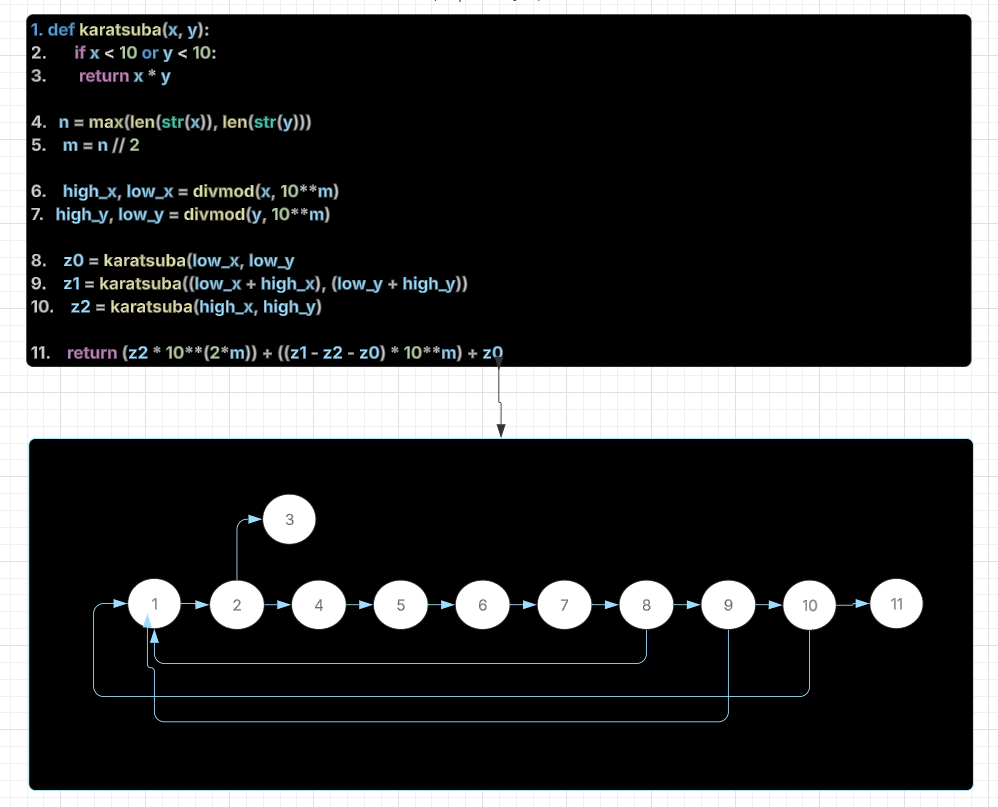

# Karatsuba Algorithm

This project implements the **Karatsuba algorithm**, a recursive method for multiplying large numbers more efficiently than the traditional approach.
This was developed for the Foundations of Algorithm Design and Analysis course at the PUC Minas university, in the 5th period.
My teacher is João Paulo Aramuni.

# About
The Karatsuba algorithm is used by the system to perform fast multiplication on two n-digit numbers, i.e. the system compiler takes lesser time to compute the product than the time-taken by a normal multiplication.

# Run
1. This project was developed in Python 3, so you need to have Python installed on your machine to run the code.
You can follow this [tutorial](https://code.visualstudio.com/docs/python/python-tutorial).

2. Clone this repository.

3. After that, to run the code, use the followind comand in the repository root:

```
python3 main.py
```

# Structure

This repository contains two `.py` files:
- algorithm.py: Implements the Karatsuba multiplication algorithm.
- main.py: Contains the main function that runs the Karatsuba algorithm.


# Explanation of the algorithm

### **Function Definition (`algorithm.py`)**  
```python
def karatsuba(x, y):
```
- Defines the function `karatsuba(x, y)`, which takes two numbers as input and returns their product using the Karatsuba multiplication method.  

### **Base Case**  
```python
    if x < 10 or y < 10:
        return x * y
```
- If either `x` or `y` is a single-digit number, the function directly returns their product.  
- This serves as the base case for the recursion, stopping further breakdown of numbers.  

### **Determining the Size of Numbers**  
```python
    n = max(len(str(x)), len(str(y)))
    m = n // 2
```
- Converts `x` and `y` to strings to determine the number of digits.  
- `n` stores the maximum number of digits between `x` and `y`.  
- `m` represents half the size of the larger number, used for splitting.  

### **Splitting the Numbers**  
```python
    high_x, low_x = divmod(x, 10**m)
    high_y, low_y = divmod(y, 10**m)
```
- Uses `divmod()` to split both numbers into **higher** and **lower** parts based on `m`.  
- This follows the principle:  
  - `x = high_x * 10^m + low_x`  
  - `y = high_y * 10^m + low_y`  

### **Recursive Multiplications**  
```python
    z0 = karatsuba(low_x, low_y)        
    z1 = karatsuba((low_x + high_x), (low_y + high_y)) 
    z2 = karatsuba(high_x, high_y)       
```
- Recursively computes three subproducts:  
  1. `z0 = karatsuba(low_x, low_y)`: Multiplication of the lower parts.  
  2. `z2 = karatsuba(high_x, high_y)`: Multiplication of the higher parts.  
  3. `z1 = karatsuba((low_x + high_x), (low_y + high_y))`: Mixed multiplication of sum parts.  

### **Combining the Results**  
```python
   
    return (z2 * 10**(2*m)) + ((z1 - z2 - z0) * 10**m) + z0
```
- Uses the **Karatsuba formula** to reconstruct the final result:  
  \[
  x \times y = (z2 \times 10^{2m}) + ((z1 - z2 - z0) \times 10^m) + z0
  \]
- This efficiently calculates the product with fewer multiplications compared to the traditional method.  

---

### **Main Function (`main.py`)**  

```python
from algorithm import karatsuba

def main():
    
    num1 = int(input("Enter the first number: "))
    num2 = int(input("Enter the second number: "))

    result = karatsuba(num1, num2)

    print(f"The result of multiplying {num1} and {num2} using the Karatsuba algorithm is: {result}.")

if __name__ == "__main__":
    main()
```

### **Explanation**  
- Imports the `karatsuba` function from `algorithm.py`.  
- Defines `main()`, which:  
  1. Prompts the user to input two numbers.  
  2. Calls the `karatsuba` function to compute their product.  
  3. Prints the result in a formatted string.  
- Runs `main()` when the script is executed.  


# Control flow graph



Source [here](https://lucid.app/lucidchart/4a90bde0-493f-4422-9f42-62c336b7fb18/edit?viewport_loc=-132%2C11%2C2505%2C1249%2C0_0&invitationId=inv_cba967d9-866c-47af-8c1d-922e2efcea95).

# Cyclomatic complexity

Using **McCabe’s formula**:  M = E - N + 2P   
E = 13, N = 11, P = 1     
Cyclomatic Complexity (M) = 4

# Asymptotic complexity
| Case | Condition | Complexity |
|------|------------|------------|
| **Best Case** | One of the numbers is a single digit | **O(1)** |
| **Average Case** | Numbers of similar size, recursive splitting | **O(n^{1.585})** |
| **Worst Case** | Large numbers requiring full recursion depth | **O(n^{1.585})** |


# References

Knowing more about the Karatsuba Algorithm: [Link1](https://www.ime.usp.br/~pf/analise_de_algoritmos/aulas/karatsuba.html), [Link2](https://www.tutorialspoint.com/data_structures_algorithms/karatsuba_algorithm.htm), [Link3](https://pythonandr.com/2015/10/13/karatsuba-multiplication-algorithm-python-code/), [Link4](https://www.geeksforgeeks.org/karatsuba-algorithm-in-python/).

Understanding Python: [Link1](https://www.hashtagtreinamentos.com/if-name-main-no-python?gad_source=1&gclid=Cj0KCQiAq-u9BhCjARIsANLj-s2S4TVbASTtvNdV_6UvXotC6T7M-GpJpZRN2-7Ob3hq6EH01BPZVNkaAv0XEALw_wcB), [Link2](https://www.alura.com.br/artigos/o-que-significa-if-name-main-no-python?srsltid=AfmBOorHgGYv2IBDZbwAVxvqfocZuWdL4UVRk2wNZclpGkO1Yr5QxGRw), [Link3](https://pt.stackoverflow.com/questions/237836/como-usar-fun%C3%A7%C3%B5es-que-est%C3%A3o-em-um-arquivo-diferente-python), [Link4](https://www.hashtagtreinamentos.com/import-no-python).


